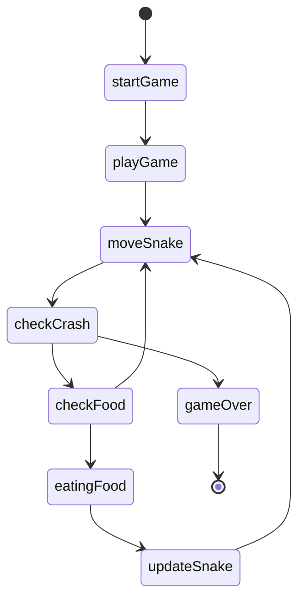
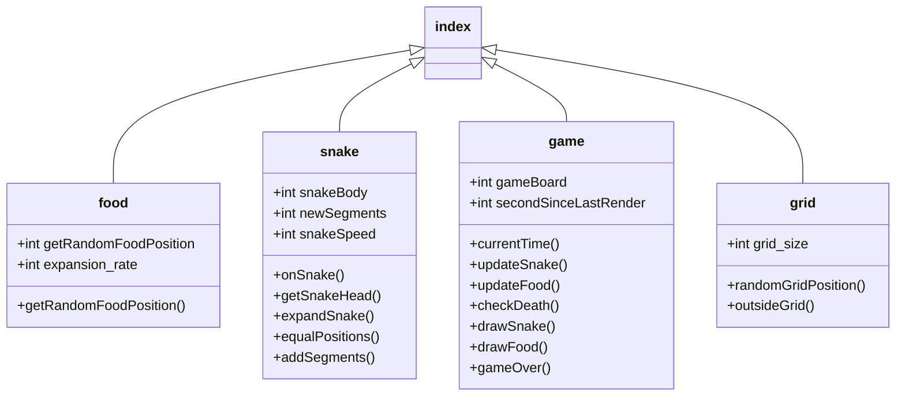

# SNAKE

Jedná se o klasickou hru Snake. V češtině známou pod názvem Had. Had sbírá na hracím poli jídlo (Food). Po snězení jídla vyroste o jeden článek těla. Když se had kousne do svého těla nebo narazí do zdi, hra končí.
  
Hra se restartuje/nastartuje při načtení okna. Zmáčknutím šipky pohybu se had rozpohybuje a tím začne hra.
  
Hráč bude pro pohyb používat šipky nebo WSAD. Současně by měl mít možnost využít tlačítko Pauza. Popř. možná i Restart, Start, atd.
  
Grafické rozhraní bude jednoduché. Čtvercové pole s barevným pozadím. Jídlo (Food) bude mít odlišnou výraznou barvu, had (Snake) bude mít též odlišnou výraznou barvu a obojí bude ve tvaru čtverečku. Budou se pohybovat po „čtvercové síti".

 

## Use case diagram

 

## Class diagram

